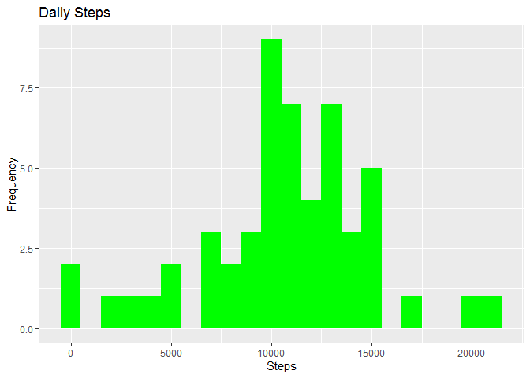
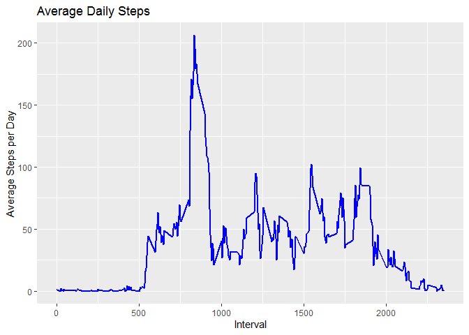
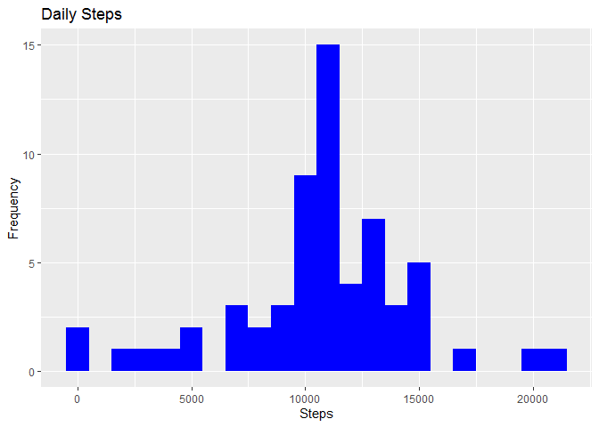
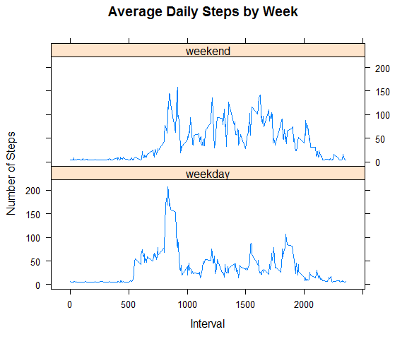

## Loading and preprocessing the data

```r
library(data.table)
library(ggplot2)
url <- "https://github.com/alizhan11/RepData_PeerAssessment1/blob/master/activity.zip"
path <- getwd()
download.file(url, file.path(path, 'dataFiles.zip'), method = 'curl')
unzip('dataFiles.zip', exdir = 'data')
```

```
## Warning in unzip("dataFiles.zip", exdir = "data"): ошибка 1 при распаковке zip-
## файла
```

```r
activity <- data.table::fread('data/activity.csv')
```


## What is mean total number of steps taken per day?

### 1. Calculate the total steps taken per day

```r
totalStep <- activity[, c(lapply(.SD, sum, na.rm = FALSE)), .SDcols = c('steps'), by = .(date)]
head(totalStep, 10)
```

```
##           date steps
##  1: 2012-10-01    NA
##  2: 2012-10-02   126
##  3: 2012-10-03 11352
##  4: 2012-10-04 12116
##  5: 2012-10-05 13294
##  6: 2012-10-06 15420
##  7: 2012-10-07 11015
##  8: 2012-10-08    NA
##  9: 2012-10-09 12811
## 10: 2012-10-10  9900
```
### 2.Make a histogram of total steps taken each day

```r
ggplot(totalStep, aes(x = steps)) + 
        geom_histogram(fill = 'green', binwidth = 1000) + 
        labs(title = 'Daily Steps', x = "Steps", y = "Frequency")
```

```
## Warning: Removed 8 rows containing non-finite values (stat_bin).
```

<!-- -->

### 3. Calculate the mean and median of total number per day

```r
totalStep[, .(meanSteps = mean(steps, na.rm = TRUE), medianSteps =median(steps, na.rm = TRUE))]
```

```
##    meanSteps medianSteps
## 1:  10766.19       10765
```
## What is the average daily activity pattern?
### 1. Make a time series plot

```r
interval <- activity[, c(lapply(.SD, mean, na.rm =TRUE)) 
                     , .SDcols = c('steps'), by = .(interval)]
ggplot(interval, aes(x = interval, y = steps)) + 
        geom_line(color = "blue", size = 1) +
        labs(title = "Average Daily Steps", x= "Interval", y = "Average Steps per Day")
```

<!-- -->

### 2. Which 5-minute interval, on average across all the days in the dataset, contains the maximum number of steps

```r
interval[steps == max(steps), .(maxInterval = interval)]
```

```
##    maxInterval
## 1:         835
```

## Imputing missing values
### 1.Calculate the total number of missing values

```r
nrow(activity[is.na(steps),])
```

```
## [1] 2304
```
### 2. Fill in the missing values with median/mean of dataset

```r
activity[is.na(steps), "steps"] <- activity[, c(lapply(.SD, mean, na.rm = TRUE)), .SDcols = c("steps")]
```

```
## Warning in `[<-.data.table`(`*tmp*`, is.na(steps), "steps", value =
## structure(list(: 37.382600 (type 'double') at RHS position 1 truncated
## (precision lost) when assigning to type 'integer' (column 1 named 'steps')
```

```r
head(activity, 10)
```

```
##     steps       date interval
##  1:    37 2012-10-01        0
##  2:    37 2012-10-01        5
##  3:    37 2012-10-01       10
##  4:    37 2012-10-01       15
##  5:    37 2012-10-01       20
##  6:    37 2012-10-01       25
##  7:    37 2012-10-01       30
##  8:    37 2012-10-01       35
##  9:    37 2012-10-01       40
## 10:    37 2012-10-01       45
```

### 3. Creat a new dataset that equals to original but with missed data filled in

```r
data.table::fwrite(x = activity, file = "data/tidyData.csv", quote = FALSE)
```

### 4. Make a histogram of the total number of steps taken each day and Calculate and report the mean and median total number of steps taken per day. Do these values differ from the estimates from the first part of the assignment? What is the impact of imputing missing data on the estimates of the total daily number of steps?

```r
# Total steps taken by date
totalStepsNew <- activity[, c(lapply(.SD, sum, na.rm =TRUE)), .SDcols = c('steps'), by = .(date)]

ggplot(totalStepsNew, aes(x = steps)) + 
        geom_histogram(fill = "blue", binwidth = 1000) + 
        labs(title = "Daily Steps", x = "Steps", y = "Frequency")
```

<!-- -->
####Difference between means and medians

```r
totalStepsNew[, .(meanSteps = mean(steps), medianSteps = median(steps))]
```

```
##    meanSteps medianSteps
## 1:  10751.74       10656
```

```r
summary(totalStep$steps)
```

```
##    Min. 1st Qu.  Median    Mean 3rd Qu.    Max.    NA's 
##      41    8841   10765   10766   13294   21194       8
```

```r
summary(totalStepsNew$steps)
```

```
##    Min. 1st Qu.  Median    Mean 3rd Qu.    Max. 
##      41    9819   10656   10752   12811   21194
```

## Are there differences in activity patterns between weekdays and weekends?

### 1. Create a new factor variable in the dataset with two levels – “weekday” and “weekend” indicating whether a given date is a weekday or weekend day. 

```r
#Recreating the variable to be understandable 
Sys.setlocale("LC_TIME", "English")
```

```
## [1] "English_United States.1252"
```

```r
activityNew <- data.table::fread("data/tidyData.csv")
activityNew[, date := as.POSIXct(date, format = "%Y-%m-%d")] 
activityNew[, `weekday`:= weekdays(x = date)]
activityNew[grepl(pattern = "Monday|Tuesday|Wednesday|Thursday|Friday", x = `weekday`), "week"] <- "weekday"
activityNew[grepl(pattern = "Saturday|Sunday", x = `weekday`), "week"] <- "weekend"
activityNew[, `week` := as.factor(`week`)]
head(activityNew, 10)
```

```
##     steps       date interval weekday    week
##  1:    37 2012-10-01        0  Monday weekday
##  2:    37 2012-10-01        5  Monday weekday
##  3:    37 2012-10-01       10  Monday weekday
##  4:    37 2012-10-01       15  Monday weekday
##  5:    37 2012-10-01       20  Monday weekday
##  6:    37 2012-10-01       25  Monday weekday
##  7:    37 2012-10-01       30  Monday weekday
##  8:    37 2012-10-01       35  Monday weekday
##  9:    37 2012-10-01       40  Monday weekday
## 10:    37 2012-10-01       45  Monday weekday
```

### 2.Make a panel plot containing a time series plot (i.e. \color{red}{\verb|type = "l"|}type = "l") of the 5-minute interval (x-axis) and the average number of steps taken, averaged across all weekday days or weekend days (y-axis). See the README file in the GitHub repository to see an example of what this plot should look like using simulated data.

```r
library(lattice)
intervalNew <- activityNew[, c(lapply(.SD, mean)), .SDcols = c("steps"), by = .(interval, `week`)]

xyplot(steps~interval | week, intervalNew, type = "l"
       , layout = c(1, 2)
       , main = "Average Daily Steps by Week"
       , xlab = "Interval"
       , ylab = "Number of Steps")
```

<!-- -->
